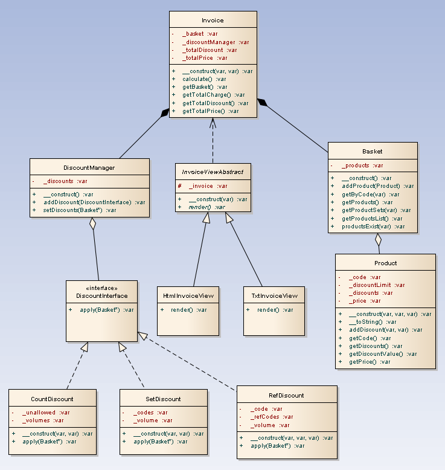

# basket

Есть продукты A, B, C, D, E, F, G, H, I, J, K, L, M. Каждый продукт стоит определенную сумму.
Есть набор правил расчета итоговой суммы:

<ol>
	<li>Если одновременно выбраны А и B, то их суммарная стоимость уменьшается на 10% (для каждой пары А и B)</li>
	<li>Если одновременно выбраны D и E, то их суммарная стоимость уменьшается на 5% (для каждой пары D и E)</li>
	<li>Если одновременно выбраны E,F,G, то их суммарная стоимость уменьшается на 5% (для каждой тройки E,F,G)</li>
	<li>Если одновременно выбраны А и один из [K,L,M], то стоимость выбранного продукта уменьшается на 5%</li>
	<li>Если пользователь выбрал одновременно 3 продукта, он получает скидку 5% от суммы заказа</li>
	<li>Если пользователь выбрал одновременно 4 продукта, он получает скидку 10% от суммы заказа</li>
	<li>Если пользователь выбрал одновременно 5 продуктов, он получает скидку 20% от суммы заказа</li>
	<li>Описанные скидки 5,6,7 не суммируются, применяется только одна из них</li>
	<li>Продукты A и C не участвуют в скидках 5,6,7</li>
	<li>Каждый товар может участвовать только в одной скидке. Скидки применяются последовательно в порядке описанном выше.</li>
</ol>

Необходимо написать программу на PHP с использованием ООП которая имея на входе набор продуктов (один продукт может встречаться несколько раз) рассчитывала суммарную их стоимость.
Программу необходимо написать максимально просто и максимально гибко.
Все параметры задаются в программе статически (пользовательский ввод обрабатывать не нужно). Оценивается подход к решению задачи. Тщательное тестирование решения проводить не требуется.

Пожелания к решению:
<ul>
	<li>Чтобы в коде были учтены принципы SOLID (особенно инверсия зависимостей)</li>
	<li>Взаимоотношения (контракты) между объектами должны быть прозрачны</li>
	<li>Низкая связанность, высокая связность</li>
	<li>Желательно предпочтение динамически зависимостям над статическими</li>
	<li>Выделение архитектурных слоев - бизнес-логика, инфраструктурный, операционный (см. Domain driven design)</li>
</ul>

Demo: https://pf-soft.net/cv/basket/